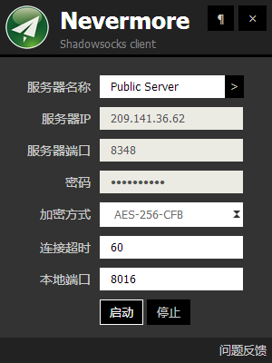
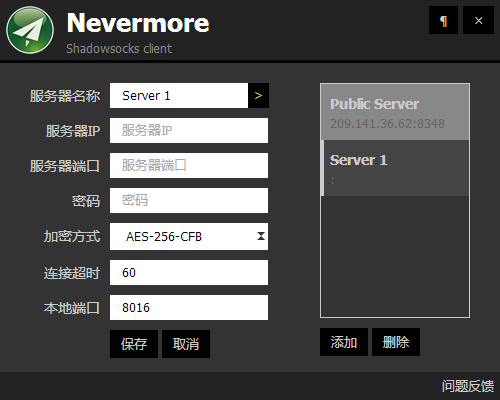
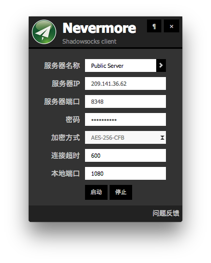

## Nevermore

用 Node-webkit + Angular.js 实现的 ShadowSocks 客户端客户端，取名Nevermore，玩过Dota的应该知道这是影魔（Shadow Fiend）的名字，所以界面大面积使用了阴暗色

* 启动按钮高亮表示代理服务正在运行
* 点关闭按钮是最小化到托盘，右击退出真正退出
* 双击服务器名称或连接超时或本地端口修改参数

#### 2014-10-07 v0.2beta 发布
* 加入提示信息
* 加入 angular-toggle-switch，服务状态更加清晰
* 加入 angular-translate，提供多语言支持
* 加入base64以及二维码分享功能
* 加入配置文件导入导出功能
* bug修复

#### 2014-09-19 v0.1 发布
[下载Windows客户端](https://github.com/nihgwu/Nevermore/releases/download/v0.1/Nevermore-v0.1-win.zip) [下载MacOS客户端](https://github.com/nihgwu/Nevermore/releases/download/v0.1/Nevermore-v0.1-osx.zip)

#### 2014-09-16 v0.1beta 发布
[下载Windows客户端](https://github.com/nihgwu/Nevermore/releases/download/v0.1beta/Nevermore-v0.1beta-win.zip) [下载MacOS客户端](https://github.com/nihgwu/Nevermore/releases/download/v0.1beta/Nevermore-v0.1beta-osx.zip)

#### TODO
* 设置界面，加入多语言、皮肤等
* 本地配置文件替换
* 重新设计图标（希望有会设计的伙伴加入）

   

